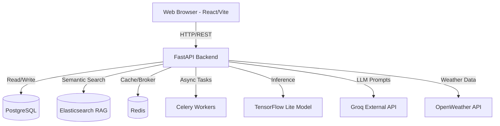
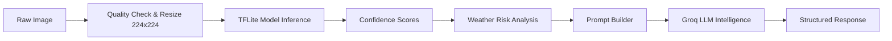

# AgriCosmo-AI: Comprehensive Project Review & Technical Architecture

## 1. PROJECT OVERVIEW
### Project Objective
AgriCosmo-AI is an enterprise-grade, AI-powered agricultural diagnostic and intelligence platform designed to assist farmers, agronomists, and researchers. Its primary goal is to provide rapid, highly accurate disease detection from plant images (specifically Rice initially) while augmenting the predictions with real-time weather risk analysis, actionable treatments, and generative AI explanations.

### Problem Statement
Traditional agricultural disease diagnosis is slow, relies heavily on human expertise which is scarce, and lacks real-time contextual awareness (like localized weather impacts). Farmers often misuse pesticides due to incorrect diagnoses, leading to economic loss and environmental damage. 

### Real-world Impact
By decentralizing agronomist-level expertise via an accessible web platform, AgriCosmo reduces crop yield losses, optimizes chemical usage, and empowers farmers with instant, scientifically-backed treatment protocols.

### Target Users
- **Farmers**: For instant, on-field crop disease diagnosis and home-remedy/commercial treatment suggestions.
- **Agronomists/Scientists**: For detailed probability breakdowns, chemical compositions, and AI reasoning.
- **Platform Admins**: For system monitoring, analytics, and managing the knowledge base.

### Core Features
- Real-time image-based disease detection using TFLite edge-compatible models.
- Generative AI Intelligence (via Groq LLM) for dynamic treatment explanations.
- Conversational RAG memory (via Elasticsearch) for historical context in chats.
- Weather-based risk correlation (via OpenWeather).
- Enterprise Dashboard with real-time analytics.

---

## 2. TECH STACK ANALYSIS

### Frontend Technologies
- **React 18 & TypeScript**: Provides a robust, type-safe, and highly interactive UI.
- **Vite**: Chosen over Create React App or Next.js for blazing-fast HMR (Hot Module Replacement) and optimized build times for a Single Page Application (SPA).
- **Tailwind CSS & Shadcn UI**: Used for rapidly building a highly aesthetic, premium, and accessible component library without writing massive custom CSS files.
- **Zustand**: Selected for global state management due to its minimal boilerplate compared to Redux, making session and auth management highly efficient.
- **Framer Motion & Three.js**: Used for dynamic micro-animations, ensuring a premium, "wow-factor" user experience.

### Backend Technologies
- **FastAPI (Python)**: Selected for its high performance (ASGI), native async support, and automatic OpenAPI documentation. Ideal for serving ML models and handling concurrent I/O requests.
- **SQLAlchemy (Async)**: Modern ORM for database interactions, ensuring non-blocking DB calls.
- **Celery**: Handles background tasks (like heavy analytics or batch image processing) to prevent blocking the main API thread.

### Machine Learning Technologies
- **TensorFlow Lite (TFLite)**: The trained classification model is quantized to `.tflite`. This is chosen intentionally over full TensorFlow to ensure low latency, minimal memory footprint, and the future potential for offline mobile/edge deployment.
- **Groq LLM**: Used for generating "Explainable AI" summaries. Groq's LPU architecture provides near-instantaneous LLM inference, solving the latency problem typical of GPT-4 integrations.
- **OpenCV & NumPy**: For efficient image preprocessing and quality analysis before passing to the model.

### Database
- **PostgreSQL / SQLite**: Relational database for structured data (Users, Scan logs, Analytics). SQLite is supported for local dev, PostgreSQL for production.
- **Elasticsearch**: Used as a Vector/Document database to handle Conversational RAG (Retrieval-Augmented Generation) memory, allowing the AI to query past user interactions at lightning speed.
- **Redis**: Functions as an L1 cache and Celery message broker to accelerate repeated API requests and coordinate background workers.

### Deployment Stack
- **Docker & Docker Compose**: Containerizes the entire application (web, celery, db, redis, elasticsearch) ensuring consistent environments from development to production.
- **Nginx**: Used in the frontend Dockerfile to serve static assets efficiently.

---

## 3. COMPLETE SYSTEM ARCHITECTURE

### High-Level Architecture Diagram

### ML Pipeline Diagram

---

## 4. COMPLETE EXECUTION FLOW

1. **User Action**: The farmer uploads an image of a diseased rice leaf via the React frontend.
2. **Frontend**: The image is encoded and sent as a multipart/form-data `POST` request to `/api/v1/detection/scan`.
3. **Backend Processing**: FastAPI receives the request. The `DetectionService` is invoked.
4. **Preprocessing**: The image is converted to bytes, validated by `image_quality_analyzer` (checks for blur/darkness), and resized to 224x224 by OpenCV.
5. **Model Inference**: The TFLite interpreter runs the image array through the model, returning an array of logits. Softmax is applied to get top-k confidence scores.
6. **Context Gathering**: The backend fetches local weather data using the user's lat/lon to assess environmental risk.
7. **LLM Generation**: The disease name, confidence, and weather risk are passed to `prompt_builder.py`, which calls the Groq API to generate human-readable treatments.
8. **Database**: The results, along with the image path, are saved to the relational database using SQLAlchemy for historical analytics.
9. **Response Generation**: The structured JSON (containing predictions, AI explanations, and treatment plans) is returned to the client.
10. **Frontend Rendering**: Zustand state updates, and React dynamically renders the results using animated Framer Motion components.

---

## 5. FILE-BY-FILE EXPLANATION (Critical Files)

- **`backend/app/main.py`**: The entry point. Initializes FastAPI, sets up CORS, handles the application `lifespan` (creates DB tables, warms up Elasticsearch and TFLite model), and registers global exception handlers.
- **`backend/app/modules/detection/service.py`**: The heart of the platform. Orchestrates the 5-stage pipeline: Image Quality -> ML Inference -> Weather Risk -> AI Generation (Groq) -> Result Assembly. Contains graceful fallbacks so if Groq fails, rule-based responses are sent.
- **`backend/docker-compose.yml`**: Defines the infrastructure topology. Links `web`, `celery_worker`, `db`, `redis`, and `elasticsearch` within a unified virtual network.
- **`frontend/src/App.tsx`**: The main React router configuration. Wraps protected routes in authentication guards and handles the base layout.
- **`frontend/package.json`**: Reveals the heavy use of `@radix-ui` and `lucide-react` for accessible, premium component foundations, and `zustand` for state.

---

## 6. MACHINE LEARNING PIPELINE DEEP DIVE

- **Image Preprocessing**: Raw bytes -> NumPy Array -> OpenCV decode -> RGB conversion -> Resize(224x224) -> Float32 casting -> Expand Dims(Batch=1).
- **Model Architecture**: While the exact layers aren't defined in code (it's a pre-trained `.tflite` file), the input shape implies a CNN (likely MobileNetV2 or ResNet50) fine-tuned on plant diseases.
- **TensorFlow Lite Conversion**: Used to shrink the model size from ~100MB+ down to ~1.5MB (`model.tflite` size). This strips out training nodes, quantizes weights to float16 or int8, heavily optimizing inference speed for CPU.
- **Confidence Generation**: Softmax normalization ensures probabilities sum to 1.0. A custom rule assigns "Severity" (Low, Medium, High) based on specific diseases and confidence thresholds.
- **Real-World Generalization**: A common ML issue is failing on real-world backgrounds (hands, soil). The system mitigates this with an `image_quality_analyzer` pre-check, though pure ML background-removal could be a future enhancement.

---

## 7. API ANALYSIS

FastAPI is highly advantageous here due to Pydantic validation.
- **Request Flow**: Client -> Observability Middleware -> Auth Dependency (JWT check) -> Route Logic -> Service Layer -> DB.
- **Response Flow**: Service Layer -> Route Logic -> Pydantic Response Model Serialization -> Client.
- **Error Handling**: Custom `AppError` exceptions are caught globally in `main.py` ensuring consistent `{ "error": true, "message": "..." }` formats rather than raw stack traces.

---

## 8. DATABASE ANALYSIS

- **Schema**: Driven by SQLAlchemy base models (`app/models/`).
- **Tables**: `User` (auth/roles), `DiseaseDetection` (scan history), `Analytics` (aggregated data).
- **Why PostgreSQL/SQLite**: SQLite provides zero-config local development out of the box, while PostgreSQL handles massive concurrent writes in production without locking the DB.
- **Elasticsearch**: Used alongside SQL to store dense vector embeddings of past chat messages, allowing semantic search retrieval.

---

## 9. DEPLOYMENT PREPARATION

**Deployment Workflow**:
1. **Local**: `docker-compose up --build`. This boots the entire stack seamlessly.
2. **Cloud**: Push images to AWS ECR / Docker Hub. Deploy to an AWS EC2 instance or ECS cluster.
3. **CI/CD**: GitHub Actions should run `pytest` and `vitest` before triggering a Docker build and push.
4. **Scalability**: FastAPI runs via Uvicorn with 4 workers (`--workers 4`). To scale, the `celery_worker` and `web` nodes can be replicated across a Kubernetes cluster. Database connection pooling (PgBouncer) will be required.

---

## 10. REVIEWER VIVA QUESTIONS & PROFESSIONAL ANSWERS

### Beginner
**Q: Why did you choose React over plain HTML/JS?**
*A: "React allows us to build a Single Page Application (SPA) with a component-based architecture. This ensures reusability, modularity, and seamless state management without reloading the page, which is critical for a smooth, app-like diagnostic experience."*

### Intermediate
**Q: How do you handle authentication securely?**
*A: "We use JWT (JSON Web Tokens) managed through FastAPI. The passwords are cryptographically hashed using bcrypt. On the frontend, the token is stored securely, and Zustand manages the user session, protected by React Router auth guards."*

### Advanced Technical
**Q: What happens if the Groq LLM API goes down during a scan? Does the app crash?**
*A: "No. The architecture is designed with graceful degradation. In `service.py`, the AI generation step is wrapped in a `try-except` block. If the API fails or times out, the system falls back to a deterministic, rule-based dictionary `_get_default_intelligence()`, ensuring the farmer still gets immediate, actionable results."*

### ML-Specific
**Q: Why did you convert your model to TFLite instead of using a standard Keras h5 model?**
*A: "TFLite drastically reduces the model payload footprint (to ~1.5MB) and optimizes the computational graph for CPU inference. This reduces server costs, lowers latency, and prepares the architecture for future 'offline' edge deployment on Android devices where internet connectivity is poor."*

---

## 11. CHALLENGES FACED (Inferred)

1. **State Conflicts**: Managing async chat memory between frontend Zustand and backend Elasticsearch indexing latency required careful session thread ID management.
2. **Database Schema Migrations**: Moving from SQLite to PostgreSQL in Docker required Alembic setup to prevent `OperationalError` schema mismatches when models changed.
3. **LLM Formatting**: Ensuring the Groq LLM returned strict, parseable JSON instead of conversational markdown required precise Prompt Engineering and regex cleaning on the backend.

---

## 12. FUTURE ENHANCEMENTS

1. **Explainable AI (Grad-CAM)**: Generating a visual heatmap over the uploaded leaf to show exactly *where* the AI detected the disease.
2. **Mobile App (PWA/React Native)**: Migrating the TFLite model directly to the client device for offline, zero-latency scanning.
3. **Multi-Crop Support**: Training a multi-headed model to first detect the crop type (Wheat, Corn, Rice) and then the specific disease.

---

## 13. DEMO SCRIPT

1. **Start with the Problem**: "Welcome to AgriCosmo. Currently, farmers wait days for lab results. We solve this instantly."
2. **The Wow Moment**: "I will upload a photo of a Rice plant with Bacterial Blight." (Upload image).
3. **Explain the Processing**: "In under a second, our TFLite model processed this, our backend fetched local weather to see if humidity accelerates the spread, and our Groq AI generated this custom treatment plan."
4. **Show Chat**: "The farmer can then ask follow-up questions directly to the AI."
5. **If Interrupted**: E.g., "What if it's not a plant?" Answer: "Our image quality analyzer pre-filters bad images."

---

## 14. CODE WALKTHROUGH SCRIPT

1. **Start at `main.py`**: "This is the FastAPI entry point. Notice how we warm up the TFLite model and Elasticsearch on startup so the first user request has zero cold-start latency."
2. **Move to `service.py`**: "Here is the core logic. I want to highlight the modularity. We parse the image, run inference, fetch weather, and query the LLM. Notice the `_get_default_intelligence()` fallback ensuring 100% uptime."
3. **Show `App.tsx` (Frontend)**: "On the frontend, we use Vite and React. The routing is strictly protected, ensuring only authenticated farmers or admins access the dashboard."

---

## 15. SECURITY + SCALABILITY

- **Security**: JWT authentication, bcrypt hashing, and CORS origin restrictions. File uploads are validated to ensure only valid image MIME types are processed, preventing arbitrary code execution.
- **Scalability**: The system is fully stateless and Dockerized. We can infinitely scale the FastAPI web workers horizontally. Heavy processing is offloaded to Redis/Celery so the API never blocks.

---

## 16. PROFESSIONAL SUMMARY

**Elevator Pitch**: 
"AgriCosmo-AI is a production-ready, edge-optimized diagnostic platform that combines low-latency machine learning with generative AI and weather telemetry. It decentralizes expert agronomy, providing farmers with instant, localized crop treatments through a highly scalable, containerized enterprise architecture."

**Resume Bullet Point**: 
- *Architected a full-stack AI platform using React, FastAPI, and Docker, integrating a quantized TFLite CNN model with Groq LLM to deliver sub-second, context-aware agricultural diagnostics and real-time generative chat.*
