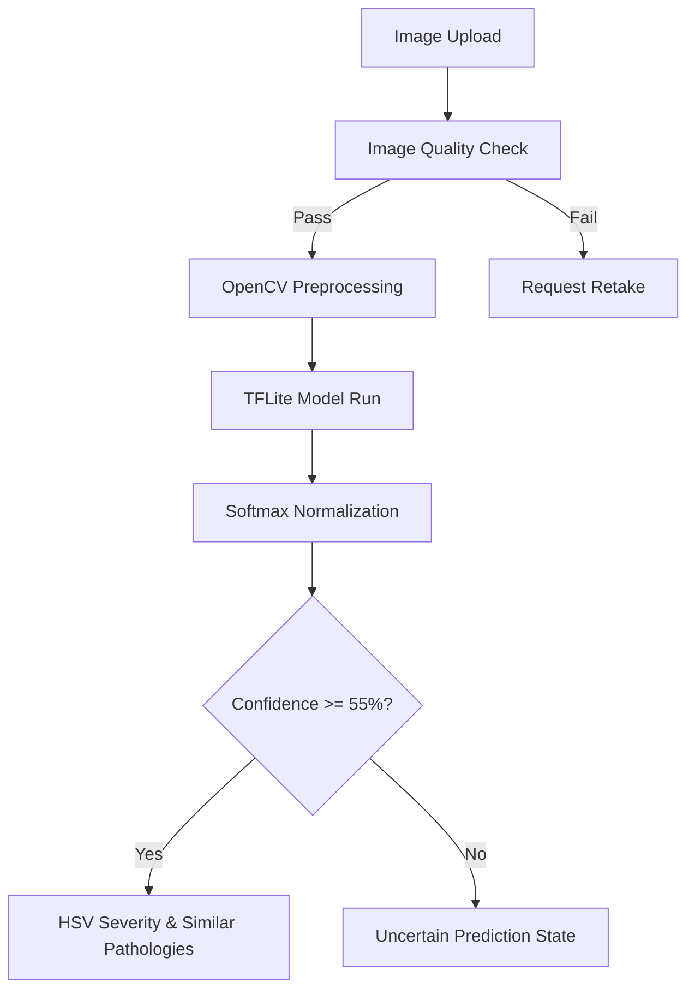
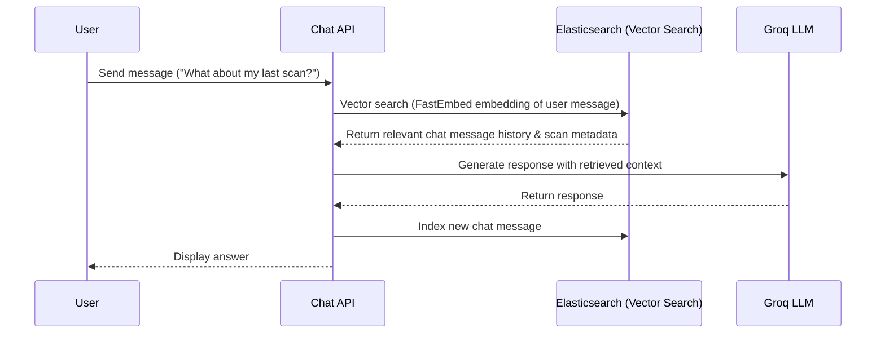
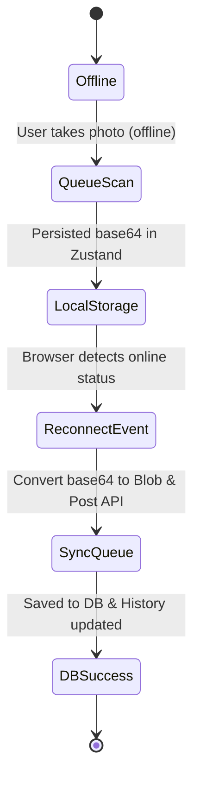

# AgriCosmo-AI System Architecture & Feature Reference Manual

This document serves as the comprehensive engineering guide for the AgriCosmo-AI Decision Intelligence platform. It details all technical layers, database interactions, machine learning flows, and user interface features.

---

## 1. 🖼️ Disease Detection & Inference Pipeline

The diagnostic system processes uploaded images through a multi-stage pipeline, combining image preprocessing, localized telemetry, quantized ML inference, and computer vision color segmentation.

### Preprocessing & Model Execution
1.  **Image Quality Analysis**: Before feeding the image to the model, an `image_quality_analyzer` inspects the byte stream for:
    *   Blur (Laplacian variance check).
    *   Under/over-exposure (brightness and contrast bounds).
    *   Centering and leaf coverage.
    *   If quality thresholds are breached, it returns a `needs_retake` flag with specific suggestions.
2.  **ML Inference (TensorFlow Lite)**:
    *   The model runs using `ai-edge-litert`.
    *   Image converted to RGB, resized to `224x224`, cast to `float32`, and normalized.
    *   Runs in a separate thread using `asyncio.to_thread` to ensure non-blocking operation.
    *   Softmax is applied to raw logits to compute probability scores:
        $$P(y=c | x) = \frac{e^{z_c}}{\sum_{j} e^{z_j}}$$
3.  **Strict Confidence Threshold (55%)**:
    *   If the primary prediction has a confidence score $< 55\%$, the platform registers an `uncertain_prediction` diagnosis.
    *   The user is recommended to retake the picture in clearer lighting instead of displaying a false diagnostic match.

### Severity & Leaf Area Estimation (HSV Segmentation)
To avoid mock data, the system utilizes computer vision thresholding in HSV color space to measure real lesion-to-leaf surface area ratios:
*   **Leaf Extraction**: Segments green pigments to isolate the leaf body.
*   **Lesion Isolation**: Segments brown, yellow, and necrotic patches.
*   **Calculation**:
    $$\text{Severity \%} = \frac{\text{Lesion Pixel Count}}{\text{Total Leaf Pixel Count}} \times 100$$
*   Translates into **Low** ($<10\%$), **Medium** ($10-25\%$), or **High** ($>25\%$) severity grades.

### Visual Similarity Analysis
*   Extracts the runner-up classifications (top 2 alternative categories) from the probability array.
*   Alternative candidates with a confidence match $> 5\%$ are presented on the dashboard as **Visually Similar Pathologies**, aiding agronomists in differential diagnosis.

---

## 2. 🧠 Hybrid AI Knowledge Engine (Static KB + Dynamic LLM)

To guarantee high uptime while delivering personalized, context-aware information, AgriCosmo uses a two-tier knowledge layer:

### Tier 1: Static Knowledge Base (JSON Lookup)
A structured local database acts as the primary validator:
*   Stores display names, taxonomy, categories (fungal, bacterial, pest), spread speed, and predefined immediate actions.
*   Serves as a high-speed lookup and a robust fallback if the AI LLM layer experiences API limits or outages.

### Tier 2: Dynamic LLM Translation Layer (Grounded Groq LLM)
*   **Grounded Prompt Construction**: If the API is active, the system builds an LLM prompt containing:
    1.  The primary disease classification.
    2.  Local weather data (humidity, precipitation, temperature).
    3.  Growth stage of the crop.
    4.  Static KB treatment options.
*   **Groq API (Llama-3.3-70b-versatile)**: Generates highly localized reports. It explains why the disease occurred (e.g., *"Rice Blast is highly active in your region because humidity levels exceed 85% with rain forecasted in the next 48 hours"*).
*   **Output Formats**: Outputs role-specific reports:
    *   **Farmer Report**: Actionable, simplified checklist, organic and chemical recipes, and local cost estimates.
    *   **Scientist Report**: Pathogen cycle stages, dataset references, biochemical impact, and research recommendations.

---

## 3. 💬 Elasticsearch-Powered Expert Chat & Conversational RAG

The agricultural AI chatbot uses Retrieval-Augmented Generation (RAG) to maintain conversational context and remember historical scans.

### Retrieval-Augmented Generation (RAG)
1.  **FastEmbed Integration**: Text messages are converted to dense vector representations (e.g., `BAAI/bge-small-en-v1.5` model).
2.  **Elasticsearch Vector Indexing**:
    *   Chat messages and scan histories are indexed as document fields.
    *   When the user asks a question, Elasticsearch executes a hybrid search (BM25 keyword search + Cosine Similarity vector search).
3.  **Context-Aware Chat Threads**:
    *   The retrieved context (past scans, previous questions) is injected into the LLM system prompt.
    *   Allows the AI to answer complex continuity questions like: *"How does the treatment for the leaf spot I scanned yesterday compare to what we did last week?"*

---

## 4. 📊 Dashboards & Analytics

AgriCosmo offers specialized dashboard views depending on the authenticated user's credentials:

### Farmer Diagnostic Dashboard
*   **Primary Diagnostic Panel**: Displays disease name, confidence score, and leaf severity rating.
*   **Visual Similarity Card**: Displays alternative diagnostic choices (with matching probabilities).
*   **Localized Weather Alert Panel**: Shows temperature/humidity warnings correlating with disease spread risks.
*   **Treatment Cards**: Step-by-step organic remedies, dosage instructions, and pesticide safety warnings.
*   **Continuous Feedback Widget**: Allows the farmer to rate the diagnosis, correct the label, and add commentary.

### Scientist & Agronomist Dashboard
*   **Pathogen Profile**: Taxonomy classification hierarchy, primary contagion mechanics, and host stages.
*   **Explainability Heatmap**: Renders the grad-CAM region of interest (visualized areas of leaf damage) highlighting what features triggered the model.
*   **Biochemical Data**: Detailed breakdown of chemical compound changes and epidemiological risks.
*   **Model Accuracy Metrics**: Displays model telemetry directly from the continuous feedback loop.

### System Telemetry & Admin Analytics
*   **Prometheus Integration**: Exposes real-time endpoints tracking inference speeds, upload sizes, API latencies, and active sessions.
*   **SQLAlchemy Analytics Tracking**: Records daily scan volumes, average system confidence, and prediction error ratios.

---

## 5. 🔌 Continuous Feedback Loops & Offline Syncing

### Continuous Feedback Loop & Retraining pipeline
*   When a user submits feedback, a background task `process_model_telemetry_and_drift` is triggered.
*   It aggregates all ratings and label mismatch corrections, calculating the system drift metric:
    $$\text{Accuracy} = \frac{\text{Total Feedbacks} - \text{Label Corrections}}{\text{Total Feedbacks}}$$
*   Logs this metric to the `AiModelMetric` database table. Platform admins can review this telemetry page to decide when to retrain the CNN model using corrected images.

### Offline Upload Queue & Synchronization
1.  **Zustand Offline Store**:
    *   The `offlineQueue` array is persisted using Zustand's local storage middleware.
    *   Scans capture geolocation coordinates (latitude, longitude) and crop types, storing the image as a compressed base64 string.
2.  **Page Interception**:
    *   If `navigator.onLine` is false when the user clicks "Analyze", the upload pipeline is bypassed.
    *   The scan metadata and image are saved to the offline queue. A toast notifies the user that the scan will sync when online.
3.  **Auto-Sync Listener**:
    *   A global `online` event listener in `App.tsx` triggers when the network connection returns.
    *   Iterates through the offline queue, converting base64 data back to standard files, uploading them, updating the scan history, and clearing the queue.
